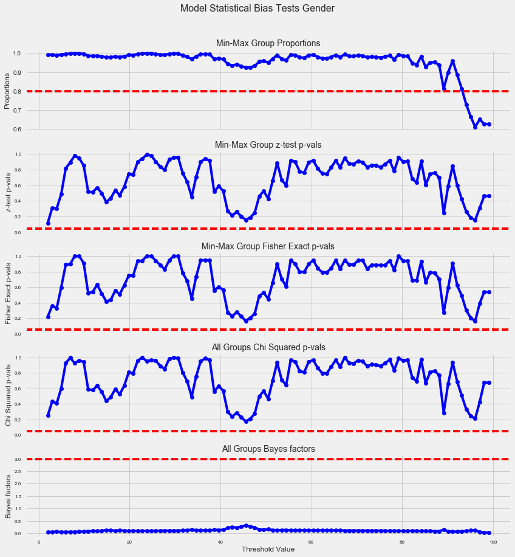

# audit-AI


Open Sourced Bias Testing for Generalized Machine Learning Applications

`audit-AI` is a Python library built on top of `pandas` and `sklearn` that
implements fairness-aware machine learning algorithms. `audit-AI` was developed
by the Data Science team at [pymetrics](https://www.pymetrics.com/)

# Bias Testing for Generalized Machine Learning Applications

`audit-AI` is a tool to measure and mitigate the effects of discriminatory
patterns in training data and the predictions made by machine learning
algorithms trained for the purposes of socially sensitive decision processes.

The overall goal of this research is to come up with a reasonable way to think
about how to make machine learning algorithms more fair. While identifying
potential bias in training datasets and by consequence the machine learning
algorithms trained on them is not sufficient to solve the problem of
discrimination, in a world where more and more decisions are being automated
by Artificial Intelligence, our ability to understand and identify the degree
to which an algorithm is fair or biased is a step in the right direction.

# Regulatory Compliance and Checks for Practical and Statistical Bias

According to the Uniform Guidelines on Employee Selection Procedures (UGESP;
EEOC et al., 1978), all assessment tools should comply to fair standard of
treatment for all protected groups. Audit-ai extends this to machine learning
methods. Let's say we build a model that makes some prediction about people.
This model could theoretically be anything -- a prediction of credit scores,
the likelihood of prison recidivism, the cost of a home loan, etc. Audit-ai
takes data from a known population (e.g., credit information from people of
multiple genders and ethnicities), and runs them through the model in question.
The proportional pass rates of the highest-passing demographic group are compared
to the lowest-passing group for each demographic category (gender and
ethnicity). This proportion is known as the bias ratio.

Audit-ai determines whether groups are different according to a standard of
statistical significance (within a statistically different margin of error) or
practical significance (whether a difference is large enough to matter on a
practical level). The exact threshold of statistical and practical significance
depends on the field and use-case. Within the hiring space, the EEOC often
uses a statistical significance of p < .05 to determine bias, and a bias ratio
below the 4/5ths rule to demonstrate practical significance.

The 4/5ths rule effectively states that the lowest-passing group has to be
within 4/5ths of the pass rate of the highest-passing group. Consider an example
with 4,000 users, 1,000 of each of the following groups: Asian, Black,
Hispanic/Latino, and White, who pass at a frequency of 250, 270, 240 and 260
users, respectively. The highest and lowest passing groups are Black (27%) and
Hispanic/Latino (24%), respectively. The bias ratio is therefore 24/27 or .889.
As this ratio is greater than .80 (4/5ths), the legal requirement enforced by
the EEOC, the model would pass the check for practical significance. Likewise,
a chi-squared test (a common statistical test for count data) would report that
these groups are above the p = .05 threshold, and therefore pass the check for
statistical significance.

Audit-ai also offers tools to check for differences over time or across
different regions, using the Cochran-Mantel-Hanzel test, a common test in
regulatory circles. To our knowledge this is the first implementation of this
measure in an open-source python format.

# Features

Here are a few of the bias testing and algorithm auditing techniques
that this library implements.

### Classification tasks

- 4/5th, fisher, z-test, bayes factor, chi squared
- sim_beta_ratio, classifier_posterior_probabilities

### Regression tasks

- anova
- 4/5th, fisher, z-test, bayes factor, chi squared
- group proportions at different thresholds

# Installation

The source code is currently hosted on GitHub: https://github.com/pymetrics/audit-ai

You can install the latest released version with `pip`.

```
# pip
pip install audit-AI
```

If you install with pip, you'll need to install scikit-learn, numpy, and pandas
with either pip or conda. Version requirements:

- numpy
- scipy
- pandas

For vizualization:
- matplotlib
- seaborn

# How to use this package:

See our implementation paper here: https://github.com/pymetrics/audit-ai/blob/master/examples/implementation_suggestions.md

```python

from auditai.misc import bias_test_check

X = df.loc[:,features]
y_pred = clf.predict_proba(X)

# test for bias
bias_test_check(labels=df['gender'], results=y_pred, category='Gender')

>>> *Gender passes 4/5 test, Fisher p-value, Chi-Squared p-value, z-test p-value and Bayes Factor at 50.00*

```
To get a plot of the different tests at different thresholds:

```python

from auditai.viz import plot_threshold_tests

X = df.loc[:,features]
y_pred = clf.predict_proba(X)

# test for bias
plot_threshold_tests(labels=df['gender'], results=y_pred, category='Gender')

```


# Example Datasets

- [german-credit](https://archive.ics.uci.edu/ml/datasets/statlog+(german+credit+data))
- [student-performance](https://archive.ics.uci.edu/ml/datasets/student+performance)
